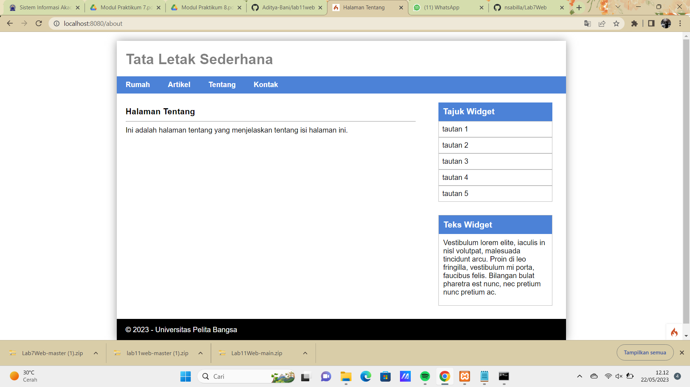

# Praktikum 7: PHP Framework (Codeigniter)

```bash
Nama: Savariana Rika Anugrahaini
Kelas: TI.21.A.3
Nim: 312110052
```

## output

Output pada Praktikum 7 - Codeigniter seperti berikut ini:



Selesai(●'◡'●)
